# redis-summary

- redis는 고성능 key-value데이터 저장소인 NoSQL(Not Only SQL)
- 문자열(string), 해시(hash), 리스트(list), 셋(set), 정렬된 셋(sorted set), 비트맵(bitmap), 하이퍼로그로그(hyperloglog)와 같은 강력한 데이터 타입 때문에 데이터 구조 서버라고도 불린다.
- 레디스는 기본적으로 모든 데이터를 메모리에 저장하기 때문에 일기와 쓰기 명령이 매우 빠르다.
- 레디스는 디스크에도 데이터를 저장할 수 있다. 레디스 데이터의 영속성(data persistance)
- help 커맨드는 도움말을 준다 keys 커맨드는 패턴과 일치하는 모든 키를 리턴하기 때문에 유용하다
- 레디스 데이터 타입의 작동 방법을 이해하면 에플리케이션 설계를 좀 더 잘할 수 있다.
- 레디스가 많은 데이터 타입을 가지고 있는 이유는 간단합니다. 하나의 크기로 모든 것을 만족시킬 수 없고, 다양한 문제가 존재하는 만큼 다양할 솔루션이 필요하기 때문이다.

## 데이터 타입
- 문자열
    - 문자열은 가장 많은 커맨드를 가지며 여러 목적으로 사용되기 때문에 레디스에서 가장 다양한 데이터 타입이다.
    - 문자열은 정수(integer) 또는 부동소수점(float), 텍스트 문자열, 비트맵 값이 기반이이고 연관 커맨드를 사용함으로써 동작한다.
    - 문자열은 문자열은 텍스트(XML, JSON, HTML, 원문 텍스트)나 정수, 부동소수점, 바이너리 데이터(비디오, 이미지, 오디오 파일)와 같이 어떠한 종류의 데이터라도 저장 가능
    - 문자열 값을 텍스트 또는 바이너리 데이터의 512MB를 초과할 수 없다.
    - 사용 예시 : 캐시 메커니즘, 자동 만료되는 캐시, Count 계산
    - Command
        - MSET, MGET : Multiple Set & Get
        - EXPIRE, TTL : set expire, check ttl
            - TTL 커맨드는 다음중 하나로 리턴한다.
                - 양의 정수 : 주어진 키가 얼마나 생존할 수 있는지 초로 보여줌
                - -2 : 키가 만료되거나 존재하지 않는 상태
                - -1 : 키가 존재하지만 만료 시간을 정하지 않음
        - (Atomic) INCR, INCRBY : 1씩 혹은 주어진 값만큼 키값를 증가시키고 증가시킨 값을 리턴한다.
        - (Atomic) DECR, DECRBY : 1씩 혹은 주어진 값만큼 키값을 감소시키고 감소시킨 값을 리턴한다.
        - (Atomic) INCRBYFLOAT, DECRBYFLOAT : 주어진 부동소수점만큼 키값을 중가 혹은 감소시키고 변경시킨 값을 리턴한다.
    - Atomic Prefix가 붙은 커맨드는 원자적 커맨드로서 서로 다른 두개의 클라이언트가 동일한 커맨드를 동시에 실행해도 동일한 값을 얻을 수 없다. 커맨드 간에는 어떠한 경합 조건도 없기 때문.
        - 레디스는 항상 한 번에 하나의 커맨드를 실행하는 싱글 스레드 기반으로 동작하기 때문에 항상 경합 조건이 발생하지 않는다.

    

        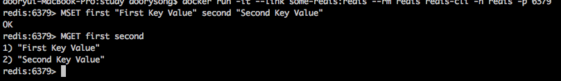 
        (MSET, MGET)
    

     
    

        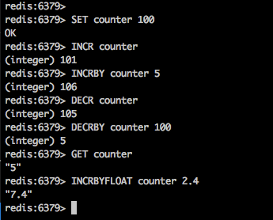 
        (INCR, INCRBY, DECR, DECRBY, INCRBYFLOAT)
    

     
    

        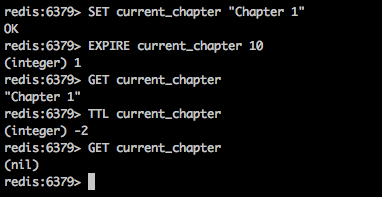 
        (EXPIRE, TTL)
    

- 리스트
    - 리스트는 간단한 콜랙션, 스택, 큐와 같이 동작할 수 있는 매우 유연한 데이터 타입이다.
    - 많은 이벤트 시스템의 큐로서 사용되는데 리스트 커맨드 역시 원자적인 특성을 갖고 있어 병렬 시스템이 큐에서 엘리먼트를 얻어낼 때 중복으로 얻지 않도록 보장해준다.
    - 레디스 리스트에 블로킹 커맨드가 존재한다. 즉 클라이언트가 비어있는 리스트에 블로킹 커맨드를 실행할 때, 클라이언트는 리스트에 새로운 엘리먼트가 추가될 때까지 기다린다는 의미다.
    - 레디스의 리스트는 Linked List라서 리스트의 처음 또는 긑에서 엘리먼트의 추가 및 삭제는 항상 O(1), 일정 시간의 성능을 가진다.
    - 즉 리스트에서 엘리먼트에 접근하는 작업은 O(N) 시간이지만 첫번째 또는 마지막 엘리먼트에는 O(1)로 접근한다.
    - 리스트의 각 엘리먼트가 list-max-ziplist-value 설정 값보다 작고, 엘리먼트 개수가 list-max-ziplist-entries 설정 값보다 작으면 리스트는 인코드 될 수 있고 메모리를 최적화 할 수 있다.
    - 리스트가 가질 수 있는 엘리먼트의 최대 개수는 2^32-1이며 40억개 이상의 엘리먼트를 가질 수 있다.
    - 리스트 실제 사용 예시는 다음과 같다. 레스큐, 셀러리, 로그스태시를 포함한 많은 툴에서 사용한다.
    - 트위터는 사용자의 최근 트윗을 저장할 때 리스트를 사용한다.
    - Command
        - LPUSH : 리스트의 처음에 데이터 추가
        - RPUSH : 리스트의 마지막에 데이터 추가
        - LLEN : 리스트의 길이를 리턴
        - LINDEX : 주어진 인덱스의 엘리먼트를 리턴 (인덱스는 0부터 시작), 리스트의 엘리먼트는 항상 왼쪽에서 오른쪽으로 접근한다. 음수로 접근할 수 있다. -1은 리스트의 끝, -2는 리스트의 끝에서 두번째 엘리먼트를 가리킨다.
        - LRANGE : 시작과 끝 인덱스를 포함시켜 주어진 인덱스 범위에 있는 모든 엘리먼트 값을 배열로 리턴한다. 인덱스는 0부터 시작하고 양수나 음수가 될 수 있다.
        - LPOP : 리스트의 첫 엘리먼트를 삭제하고 리턴
        - RPOP : 리스트의 마지막 엘리먼트를 삭제하고 리턴
        - BLPOP, BRPOP : LPOP과 RPOP을 blocking하면서 기다린다.
            - 이를 이용해서 Message Queue처럼 이용 가능
            - 해당 부분 테스트 https://spring.io/guides/gs/messaging-redis/ 에서 확인 가능

    

        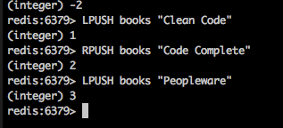 
        (LPUSH, RPUSH)
    

     
    

        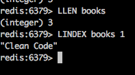 
        (LLEN, LINDEX)
    

     
    

        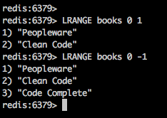 
        (LRANGE)
    

     
    

        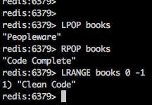 
        (LPOP, RPOP)
    

     
    

        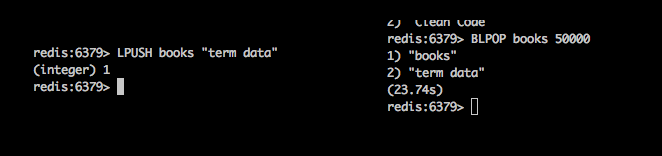 
        (BLPOP)
    

     
    

        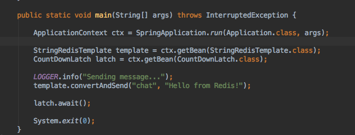 
        (Message Queue with Spring boot Code)
    

     
    

        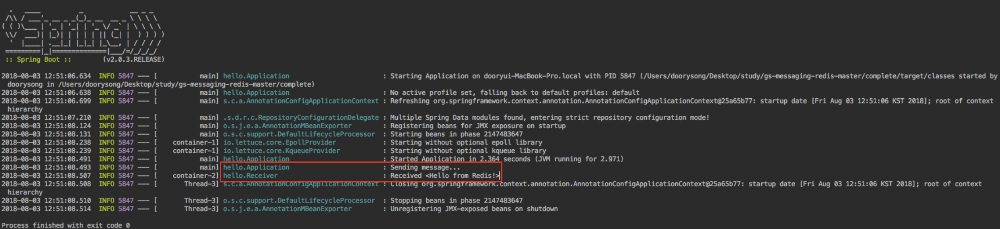 
        (Message Queue with Spring boot Result)
    

 

- 해시
    - 해시는 필드를 값으로 매핑할 수 있기 때문에 객체를 저장하는데 훌륭한 데이터 구조다.
    - 해시는 메모리를 효율적으로 쓸 수 있고, 데이터를 빨리 찾을 수 있게 최적화 되어 있다.
    - 해시에서 필드 이름과 값은 문자열이다. 따라서 해시는 문자열을 문자열로 매핑한다.
    - hash-max-ziplist-entries, hash-max-ziplist-value 설정을 기반으로 한다. (뒤에 설명함)
    - 해시는 내부적으로 ziplist와 hash table이 될 수 있다.
    - ziplist는 메모리 효율화에 목적을 둔 양쪽으로 연결된 리스트이다.
    - ziplist서는 정수를 일련의 문자로 저장하지 않고 실제 정수의 값으로 저장한다.
    - ziplist가 메모리 최적화가 돼 있다 할지라도 일정한 시간 내로 검색이 수행 되지는 않는다.
    - hash table에서는 일정한 시간 내로 검색은 되지만 메모리 최적화가 이루어지지 않는다.
    - Command
        - HSET HMSET : 키로 값 등록 (single, multiple)
        - HGET HMGET : 키로 값 조회 (single, multiple)
        - HINCR, HINCRBY, HDECR, HDECRBY, HINCRBYFLOAT, HDECRBYFLOAT : 주어진 정수 혹은 부동소수점 만큼 필드를 증가 감소 시킴. (HINCR, HDECR은 1씩 증가 감소)
        - HDEL : 해시에서 필드를 삭제
        - HGETALL : 모든 필드 조회
        - HKEYS : 모든 필드 key 조회
        - HVALS : 모든 필드 value 조회

    

        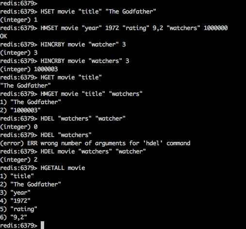 
        (HSET, HMSET, HINCRBY, HGET, HMGET, HDEL, HGETALL)
    

     

- 셋
    - 순서가 없고 동일한 물자열이 없는 콜렉션
    - 일부 커맨드(엘리먼트 추가 및 삭제, 검색의 성능 속도는 항상 O(1)이다)를 최적화해야 하기 때문에 해시 테이블로 구현
    - 셋의 모든 엘리먼트 값이 정수(integer)면 셋 메모리 영역은 줄얻르고 전체 엘리먼트 갯수는 set-max-intset-entries 설정 값만큼 커질 수 있다.
    - 셋이 가질 수 있는 엘리먼트의 최대 개수는 2^32-1이다. 즉, 한 셋에 40억개 이상의 엘리먼트를 저장할 수 있따.
    - 셋은 데이터 필터링, 데이터 그룹핑, 엘리먼트십 확인 등에 사용하기 좋다
    - Command
        - SADD : 셋에 하나 이상의 엘리먼트를 추가한ㄷ.
        - SINTER : 하나 이상의 셋을 받아 모든 셋에 공통으로 존재하는 엘리먼트를 배열로 리턴
        - SDIFF : 하나 이상의 셋을 받고 첫번째 셋의 모든 엘리멘트중 그 뒤에 따르는 셋에 존재하지 않는 엘리멘터를 배열로 리턴
        - SUNION : 하나 이상의 셋을 받고 모든 셋의 엘리먼트를 하나로 모아 리턴한다. 리턴된 결과에는 중복된 엘리먼트가 존재하지 않는다.
        - SRANDMEMBER : 셋에서 엘리먼트를 무작위로 뽑은 후 리턴한다.
        - SISMEMBER : 셋에 엘리먼트가 존재하는지 확인한다.
        - SREM : 주어진 엘리먼트를 셋에서 삭제한 후 셋에 남아있는 엘리먼트의 개수를 리턴한다.
        - SCARD : 셋의 엘리먼트 갯수를 리턴한다. (cardinality)
        - SMEMBERS : 셋의 모든 엘리먼트를 배열로 리턴

    

        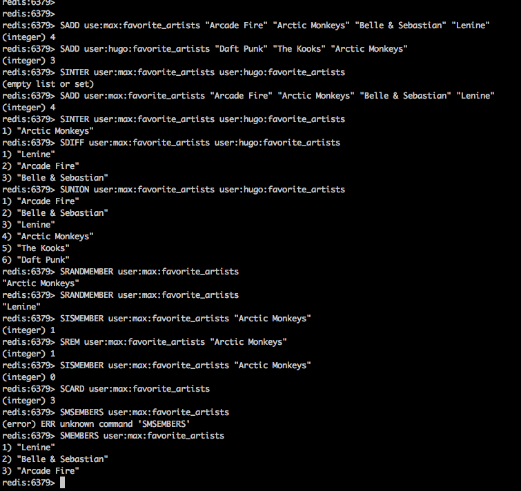 
        (SADD, SINGET, SDIFF, SUNION, SRANDOMEMBER, SREM, SISMEMBER, SCARD, SMEMBERS)
    

     

- 정렬된 셋 (sorted set)
    - 정렬된 셋은 셋과 비슷하지만, 정렬된 셋의 모든 엘리먼트는 연관 점수를 가진다.
    - 즉 sorted set은 점수로 정렬된, 중복 문자열이 없는 콜랙션이다.
    - 반복 점수를 가진 엘리먼트를 가질 수 있다. 이런 경우에 반복 엘리먼트를 사전 편집 순서대로 정렬할 수 있다.
    - 정렬된 셋 커맨드는 빠른 편이지만 점수로 엘리먼트를 비교해야 하기 때문에 셋 커맨드보다 빠르지 않다.
    - 정렬된 셋에서 엘리먼트의 추가 및 삭제, 변경 성능은 O(logN)이며 여기서 N은 정렬된 셋의 엘리먼트 개수다.
    - 정렬된 셋의 내부 구현은 2개의 분리된 데이터 구조로 되어 있다.
        1. skiplist : 순서대로 정렬된 엘리먼트를 빠르게 검색
        2. ziplist : zset-max-ziplist-entries와 zset-max-ziplist-value 설정을 기반으로 함
    - sorted set은 고객 서비스 실시간 대기 목록 만들기, 수백만개의 단어를 사용하는 자동 완성 시스템 만들기 등에서 사용 가능하다.
    - Command
        - ZADD : sorted set에 하나 이상의 엘리먼트 추가, 만약 해당 엘리먼트가 이미 존재하면 무시하고 추가된 엘리먼트의 개수를 리턴
        - ZRANGE, ZRANGEBYLEX, ZRANGEBYSCORE, ZREVRANGE, ZREVRANGEBYLEX, ZREVRANGEBYSCORE : 범위를 읽어오는데 사용
        - WITHSCORES : 범위 커맨드의 옵션, 엘리먼트의 점수를 함께 리턴
        - ZREM : 정렬된 셋에서 엘리먼트를 삭제
        - ZSCORE : 엘리먼트의 점수를 리턴한다.
        - ZRANK : 등수가 낮은 순으로 정렬된 엘리먼트의 등수를 리턴한다.
        - ZREVRANK : 등수가 높은 순에서 낮은 순으로 정렬된 엘리먼트의 등수를 리턴한다.

    

        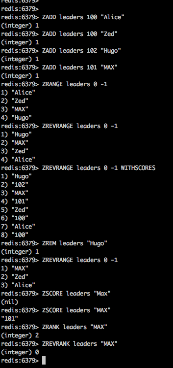 
        (ZADD, ZRANGE, ZREVRANGE, ZREM, ZSCORE, ZRANK, ZREVRANK)
    

     

- 비트맵
    - 비트맵은 레디스의 실제 데이터 타입이 아니다. 내부적으로 비트맵은 문자열이다.
    - 비트맵은 문자열의 bit 연산자 집합이라고 말할 수 있다.
    - 그러나 레디스는 문자열을 비트맵으로 제어할 수 있는 커맨드를 제공하기 때문에, 비트맵을 데이터 타입을 간주한다.
    - 비트맵은 비트 배열(bit array) 또는 배트 셋(bit set)으로 알려져 있다.
    - 비트맵은 개별 비트를 0 또는 1로 저장할 수 있는 비트 열이다.
    - 비트맵을 0과 1로 구성된 배열로 생각할 수 있다.
    - 레디스 문서는 비트맵 인덱스를 오프셋으로 나타낸다.
    - 애플리케이션 도메인은 개별 비트맵 인덱스가 무엇을 의미하는지 지시한다.
    - 비트맵은 메모리 효율이 좋고 빠른 검색을 지원하며, 2^32비트(40억비트 이상)까지 저장할 수 있다.
    - true false값을 단순히 저장할 때 쓸만하다
    - Command
        - SETBIT : 비트맵 오프셋에 값을 저장
        - GETBIT : 비트맵 오프셋 값을 리턴
        - BITCOUNT: 비트맵에 1로 표시된 모든 비트의 개수를 리턴
        - BITOP : 대상 키, 비트 연산, 해당 연산에 적용하고 결과를 대상 키에 저장할 키 목록 (OR, AND, XOR, NOT)

    

        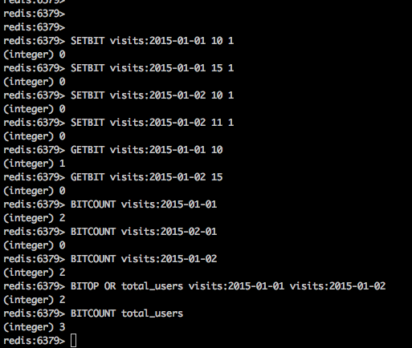 
        (SETBIT, GETBIT, BITCOUNT, BITOP, ZSCORE, ZRANK, ZREVRANK)
    

     

- 하이퍼로그로그
    - 레디스의 실제 데이터 타입이 아니다. 하이퍼로그로그는 개념적으로는 알고리즘이다.
    - 셋에 존재하는 고유 엘리먼트 개수를 아주 좋은 근사치로 제공하기 위해 확률화를 사용하는 알고리즘이다.
    - 하나의 키당 아주 작은 메모리(최대12KB)를 사용하며, 항상 O(1)로만 동작하기 때문에 매력적이다.
    - 기술적으로는 하이퍼로그로그가 실제 데이터 타입이 아닐지라도, 레디스는 하이퍼로그로그 알고리즘을 사용해 셋의 개수를 계산하기 위한 문자열 제어하는 커멘드를 제공하기 때문에 데이터타입처럼 다룰것이다.
    - 하이퍼로그로그는 100%의 정확도를 보장하지 않는 확률적인 알고리즘이다.
    - 하이퍼로그로그의 레디스 구현은 0.81퍼센트의 표준오차를 가진다.
    - 이론상 셀 수 있는 셋의 개수 제한은 사실 없다.
    - 하이퍼로그로그 논문(Philippe Flajolet, Eric Fusy, Oliver Gandouet, Frederic Meunier의 공동농문 'The analysis of a newar-optiomal cardinality estimation algorithm)에서 하이퍼로그로그 알고리즘이 처음으로 설명됐다.
    - 하이퍼로그로그에는 PFADD, PFCOUNT, PFMERGE 세 개의 커맨드만 존재한다.
    - 종종 고유 개수를 계산하기 위해, 현재 계산 중인 셋의 엘리먼트 수에 비례하는 메모리가 있어야 한다.
    - 하이퍼로그로그는 좋은 성능, 낮은 계산 비용, 적은 메모리 양으로 해당 문제를 해결한다.
    - 그러나 하이퍼로그로그는 100퍼센트 정확하지는 않다. 그럼에도 불구하고 일부 상황에서는 99.19퍼센트정도라면 충분히 괜찮을 수 있다.
    - 하이퍼로그로그는 웹사이트 고유 방문자 수 계산, 특정 날짜 또는 시간에 웹사이트에서 검색한 고유 키워드 개수 계산, 사용자가 사용한 고유 해시태그 개수 계산, 책에 나오는 고유 단어 개수 계산 등에 쓰이면 좋겠다.
    - Command
        - PFADD : 하나 이상의 문자열을 하이퍼로그로그에 추가한다.
            - 하이퍼로그로그의 개수(cardinality)가 변경되면 1을 리턴하고, 변경되지 않으면 0을 리턴한다.
        - PFCOUNT : 하나 이상의 키를 매게 변수로 받고, 근사치 개수를 리턴한다.
            - 다중 키를 명세하면 고유 엘리먼트 개수를 계산하기 위해 근사치 개수로 리턴한다.
        - PFMERGE : 대상키와 하나 이상의 하이퍼로그로그 키를 매게변수로 받아야 하며, 모든 하이퍼로그를 병합하고, 병합한 결과를 대상 키에 저장한다.

    

        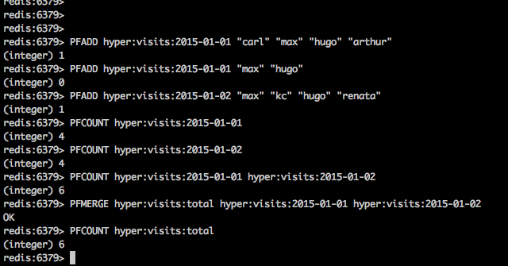 
        (PFADD, PFCOUNT, PFRANGE)
    

     
    

         
        (Hyperloglog와 set 비교)
    

     

## 커맨드
- Pub/Sub
    - Pub/Sub는 메시지를 특정 수신자에게 직접 발송하지 못하는 곳에서 쓰이는 패턴
    - Publish-Subscribe의 약자이다.
    - Publisher와 Subscriber가 특정 채널을 리스닝 하고 있다면 Publisher는 채널에 메시지를 보내고, 구독자는 발송자의 메시지를 받는다.
    - redis는 Pub/Sub 패턴을 지원하고, 메시지를 발송하고 채널을 구독하는 커맨드를 제공한다.
    - Pub/Sub 애플리케이션 예시 : 뉴스와 날씨 대시보드, 채팅, 지하철 지연 경고, SaltStack 툴이 지원하는 것과 유사한 리모트 코드의 실행
    - Command
        - PUBLISH : 메시지를 레디스 채널에 보내고 메시지를 받은 클라이언트 수를 리턴.
        - SUBSCRIBE : 클라이언트가 하나 이상의 채널을 구독한다.
        - UNSUBSCRIBE : 하나 이상의 채널에서 클라이언트를 구독 해지한다.
        - PSUBSCRIBE와 PUNSUBSCRIBE 커맨드는 SUBSCRIVE와 UNSUBSCRIBE와 동일하게 작동하지만 채널 이름은 GLOB 형태로 받는다.
            - 레디스 클라이언트가 SUBSCRIBE나 PSUBSCRIBE 커맨드를 실행한다면 구독모드에 들어가기 때문에 SUBSCRIBE, PSUBSCRIBE, UNSUBSCRIBE, PUNSUBSCRIBE 외의 다른 커맨드를 받지 않는다.
        - PUBSUB : 레디스의 PUB/SUB시스템의 상태를 조사한다.
            - 3개의 하위 커맨드 CHANNELS, NUMSUB, NUMPAT를 받는다.
            - PUBSUB CHANNELS [pattern] : 동작중인 모든 채널(최소 하나의 구독자 존재)을 리턴한다./
            - PUBSUB NUMSUB [channel-1, channel-2...] : 접속한 클라이언트의 개수를 리턴한다.
            - PUBSUB NUMPAT : PSUBSCRIBE 커맨드를 통해 접속한 클라이언트의 개수를 리턴한다.

    

        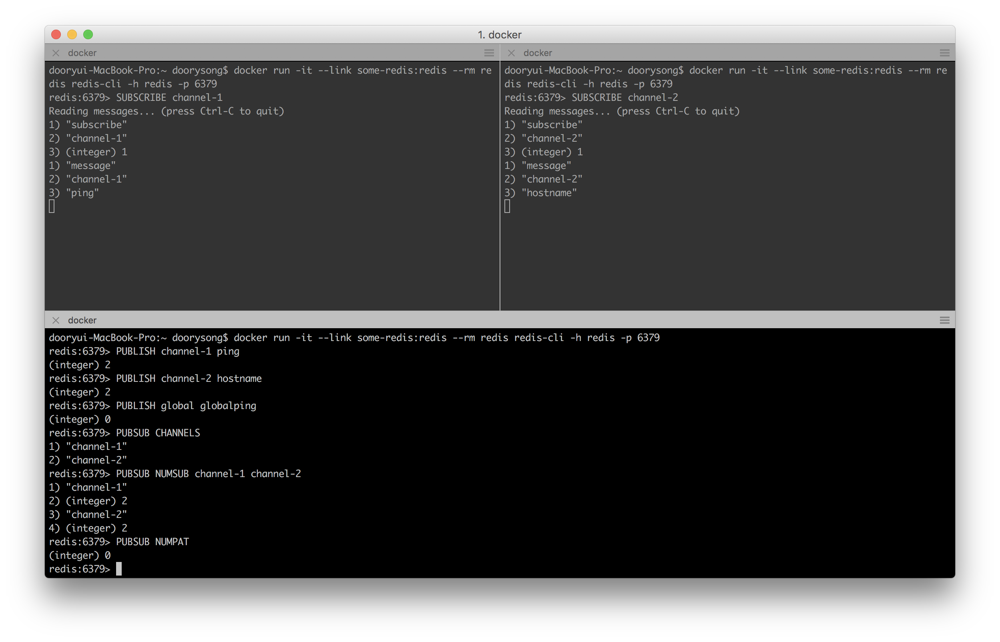 
        (command로 pub-sub 수행)
    

     
    

        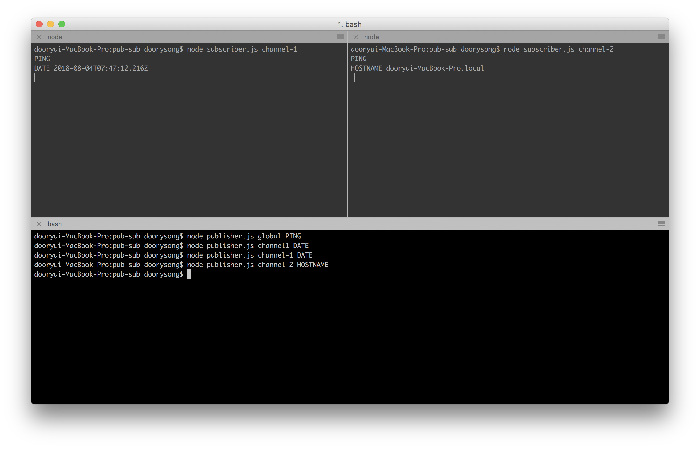 
        (node로 pub-sub 구현 - sources/pub-sub/)
    

     

            
- 트랜젝션
    - 레디스의 트랜잭션은 순서대로 원자적으로 실행되는 커맨드의 열이다. 
    - MULTI, EXEC
        - MULTI 커맨드는 트랜잭션의 시작을 표시하고, EXEC 커맨드는 트랜잭션의 마지막을 표시한다.
        - MULTI와 EXEC 커맨드 간의 모든 커맨드는 직렬화되며 원자적으로 실행된다.
        - 레디스는 트랜잭션의 처리 도중에 다른 클라이언트의 요청에 응하지 않는다.
        - 트랜잭션의 모든 커맨드는 클라이언트의 큐에 쌓이고, EXEC 커맨드가 실행되면서 서버로 전달된다.
        - EXEC 커맨드 대신 DISCARD 커맨드를 사용하면, 트랜잭션은 실행되지 않는다.
        - 기존의 SQL 데이터베이스와 달리, 레디스의 트랜잭션은 트랜잭션 과정을 실행하다 실패하더라도 롤백하지 않는다.
        - 레디스는 트랜잭션의 커맨드를 순서대로 실행하고, 커맨드 중 일부가 실패하면 다음 커맨드로 처리한다.
        - 레디스 트랜잭션의 단점은 모든 커맨드가 큐에 쌓이기 때문에, 트랜잭션 내부에서 어떠한 결정도 내릴 수 없다는 점이다.
    - WATCH, UNWATCH
        - 키 그룹에 낙관적 잡금(Optimistic Lock)을 구현한 WATCH 커맨드를 사용해 트랜잭션을 조건부로 실행할 수 있다.
        - WATCH가 커맨드는 주시받는 키를 표시하고 주시받는 키가 변경되지 않으면 EXEC 커맨드는 트랜잭션만 실행한다.
        - 주시받는 키가 변경되면 null을 리턴하고, 해당 커맨드를 다시 실행시켜야 한다.
        - UNWATCH 커맨드는 주시목록에 있는 키를 제거한다.

    

        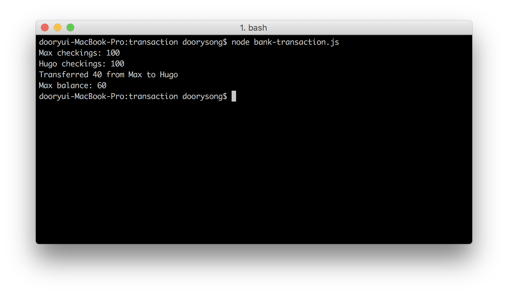 
        (node에서 멀티 exec 트랜젝션 테스트 sources/transaction/bank-transaction.js)
    

     
    

        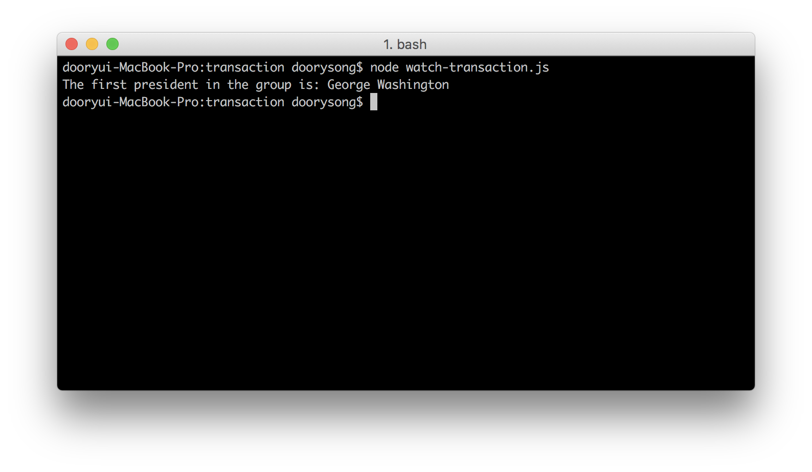 
        (node에서 watch 트랜젝션 테스트 sources/transaction/watch-transaction.js)
    

     

- 파이프라인 (자바 라이브러리 조사 필요)
    - 레디스에서 파이프라인은 다중 커맨드를 레디스 서버에 한꺼번에 보내는 방법을 말하며, 개별 응답을 기다리지 않고 클라이언트에 의해 응답을 한꺼번에 읽을 수 있다.
    - 레디스 클라이언트가 커맨드를 보내고 레디스 서버로부터 응답을 받는데 걸리는 시간을 Round Trip Time(RTT) 라고 한다.
    - 다중 커맨드를 레디스로 보내면 다중 RTT가 존재한다.
    - 파이프라인을 활용하면 이 RTT 값을 줄일 수 있다. (10개의 커맨드를 한꺼번에 보내면 10RTT가 아닌 1RTT가 걸린다.)
    - 즉 레디스 네트워크 성능을 확연히 개선할 수 있다.
    - 파이프라인으로 전달된 레디스 커맨드는 독립적이어야 한다.
        - 레디스 커맨드는 서버에서 순차적으로 실행되지만, 트렌잭션 처리가 되지 않는다.
        - 파이프라인이 전혀 트랜잭션적이거나 원자적이지 않다고 해도(서로 다론 레디스 커맨드가 하나의 파이프라인에서 실행됨) 부하가 높은 애플리케이션이 네트워크 병목 현상을 발생시키는 부분 등을 개선하는데에는 여전히 유용하다.
    - 현재 이용중인 node_redis 라이브러리는 기본적으로 파이프라인을 이용하여 커맨드를 보낸다.
    - 하지만 다른 클라이언트들은 파이프라인을 기본적으로 사용하지 않기 때문에 이 부분을 살펴볼 필요가 있다.

- 스크립트
    - 레디스에서 루아 스크립트가 실행될 수 있다.
    - 루아 스크립트는 원자적으로 실행된다, 즉 레디스 서버에서 루아 스크립트가 실행되는 동안 레디스 서버는 블록된다는 것을 의미한다.
    - 이런 이유로 레디스는 루아 스크립트를 실행하기 위해 기본 5초의 타임아웃을 가진다.
    - lua-tim-limit 설정을 수정해 루아 스크립트의 타임아웃 값을 변경할 수 있다.
    - 레디스는 루아 스크립트의 타임아웃이 발생했을 때, 자동으로 루아 스크립트를 종료하지 않는다.
    - 대신 루아 스큷트가 동작 중임을 알리기 위해모든 커멘드에 BUSY 메시지를 보낸다.
    - 루아 스크립트 실행을 취소해 서버를 정상으로 만드는 유일한 방법은 SCRIPT KILL 커맨드 혹은 SHUTDOWN NOSAVE 커맨드의 호출이다.
    - 이상적으로 스크립트는 간단해야 하고, 단일 책임을 가져야 하며, 빨리 실행돼야 한다.
    - 루아 스크립트 내에서 레디스 커맨드를 실행하는 두 개의 함수(redis.call과 redis.pcall)
        - redis.call : 커맨드 이름과 모든 함수 매개변수를 받으며 커맨드 결과를 리턴한다.
        - redis.pcall : redis.call 함수와 비슷하지만 에러가 발생할 때 루아 테이블로 에러를 리턴하고 스크립트를 계속 진행한다.
    - 루아 스크립트를 실행하는 2개의 커맨드는 EVAL, EVALSHA가 있다.
        - EVAL은 단순 루아 스크립트 실행인 반면 EVALSHA는 SCRIPT LOAD 커맨드가 리턴한 식별자를 기반으로 루아 스크립트를 실행한다.

    

        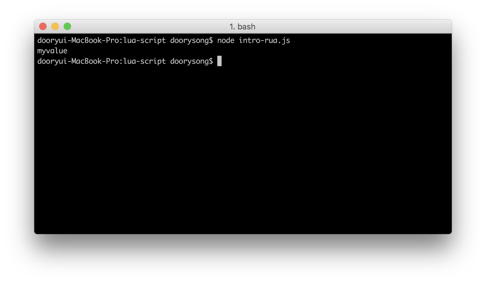 
        (node에서 lua script in redis 테스트 sources/lus-script/intro-lua.js)
    

     
    

        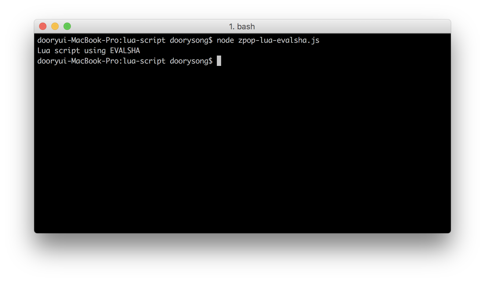 
        (node에서 lua script 를 이용하여 zpop 수행 sources/lus-script/zpop-lua.js)
    

     
    

         
        (node에서 lua script evalsha를 이용하여 zpop 수행 sources/lus-script/zpop-lua-evalsha.js)
    

     

- 기타 커맨드
    - INFO : 레디스 버전과 운영체제, 연결된 클라이언트, 메모리 사용량, 저장소, 복제본, 키 스페이스에 대한 정보를 포함한 모든 레디스 서버 통계를 리턴한다.
        - 기본적으로 INFO 커맨드는 사용할 수 있는 모든 섹션을 보여준다.
        - 매개변수로 섹션 이름을 명세헤 결과를 제한할 수도 있다. (memory, cpu 등)
    - CONFIG : 레디스 설정을 보여준다
        - 사용법 : https://redis.io/commands/config-get
    - DBSIZE : 레디스 서버에 존재하는 키 개수를 리턴한다.
    - DEBUG SEGFAULT : 올바르지 않은 메모리 접근을 수행해 레디스 서버 프로세스를 종료한다.
        - 애플리케이션 개발 중 버그를 시뮬레이션 할 때 유용하다.
    - MONITOR : 레디스 서버가 처리하는 모든 커맨드를 실시간으로 보여준다.
    - CLIENT LIST : 클라이언트에 대한 관련 정보와 통계뿐 아니라 서버에 연결된 모든 클라이언트 목록을 리턴한다.
    - CLIENT SETNAME : 클라이언트의 이름을 변경한다.
    - CLIENT KILL : 클라이언트의 연결을 종료한다. IP나 포트 iD 타입으로 클라이언트 연결을 종료할 수 있다.
    - FLUSHALL : 레디스의 모든 키를 삭제한다. 삭제한 키는 다시 복구할 수 없다.
    - RANDOMKEY : 존재하는 키 중 무작위로 선택한 하나의 키 이름을 리턴한다.
    - EXIRE : 특정 키의 타임아웃을 초 단위로 설정한다.
    - EXPIREAT : 유닉스 타임스탬프를 기반으로 특정 키의 타임아웃을 설정한다.
    - TTL : 타임아웃 값이 있는 키의 남아 있는 생존시간을 초 단위로 리턴한다.
    - PTTL : TTL과 같지만 단위가 밀리 초이다.
    - PERSIST : 특정 키에 주어진 현존 타임아웃을 제거한다.
    - SETEX : 특정 키에 값을 저장할때 만료 시간도 함께 원자적으로 설정한다.
    - DEL : 하나 이상의 키를 레디스에서 삭제한다.
    - EXISTS : 특정 키가 존재하면 1을, 존재하지 않으면 0을 리턴한다.
    - PING : PONG 문자열을 리턴한다. 레디스가 데이터를 교환할 수 있는 상태인지를 확인할 때 유용하다.
    - MIGRATE 특정 키를 대상 레디스 서버로 옮긴다. 키를 저장할 레디스 서버에 키가 존재한다면 실패한다.
    - SELECT : 클라이언트가 연결된 현재의 데이터베이스를 변경한다. (레디스는 기본적으로 다중 데이터베이스이다.)
    - AUTH : 레디스에 연결할 수 있는 클라이언트를 허가(authorization)하는 데 사용된다.
    - SCRIPT KILL : 루아 스크립트 실행을 종료한다.
    - SHUTDOWN : 모든 클라이언트를 종료하고, 최대한 데이터를 저장하려고 한 후 레디스 서버를 종료한다.
        - SAVE, NOSAVE 두개의 매개변수 중 하나를 받는다.
    - OBJECT ENCODING : 주어진 키에서 사용중인 인코딩 값을 리턴한다.

    

        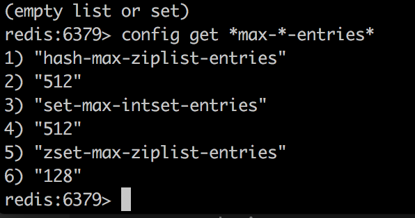 
        (max entries 관련한 config 조회)
    

     

## 데이터 타입의 최적화
- 레디스에서 모든 데이터 탙입은 메로리를 저장하거나 성능을 높이는 다양한 인코딩을 사용할 수 있다.
- 예를 들어 단지 숫자만 갖는 문자열은 다른 인코딩을 사용하기 때문에 글자만 갖는 문자열보다 메모리를 덩 사용한다.
- 데이터 타입은 레디스의 서버 설정에 정의된 임계 값을 기반으로 다양한 인코딩을 사용한다.
- 보통 redis.conf 파일에서 이러한 설정들을 확인할 수 있다.
- 문자열
    - 문자열에서 사용 가능한 인코딩 정보는 int, embstr, raw 세가지이다.
    - embstr은 40바이트보다 작은 문자열, raw는 40바이트보다 큰 문자열을 표현할 때 사용된다.

    

        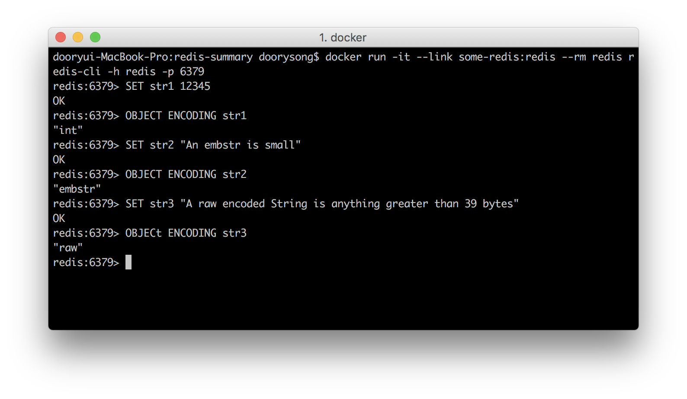 
        (string 데이터 타입)
    

     

- 리스트
    - 리스트에서 사용 가능한 인코딩은 ziplist와 linked list가 있다.
        - ziplist : 리스트 크기의 엘리먼트가 list-max-ziplist-entires 설정보다 작고, 리스트의 개별 바이트가 list-max-ziplist-value 설정보다 작다면 집 리스트가 사용된다.
        - linked list : 리스트 크기의 엘리먼트가 list-max-ziplist-entires 설정보다 크거나, 리스트의 개별 엘리먼트의 바이트가 list-max-ziplist-value 설정보다 크면 linked list가 사용된다.
    - 현재는 quick list만 사용된다고 하던데 조금 더 조사가 필요하다 (https://matt.sh/redis-quicklist)
        - ziplist가 여러개 리스트로 되어 있는 형태라고 함.
        - ziplist의 마지막보다 찾는 인덱스가 다음에 있으면 다음 ziplist로 이동하는 형식으로 다수를 skip하여 리스트 탐색 시간을 줄임

    

        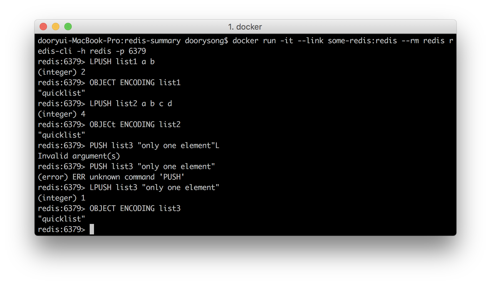 
        (list 데이터 타입 - 책에서 본 것과 다르다. 요즘은 전부 quick list라고 한다.)
    

     

- 셋
    - 셋에서 사용 가능한 인코딩은 intset, hashtable이다.
        - intset : 셋의 모든 엘리먼트가 정수고 셋의 개수가 set-max-intset-entries 설정보다 작으면 인트셋이 사용된다.
        - hashtable : 셋의 엘리먼트 중 하나라도 정수가 아니거나, 셋의 개수가 set-max-intset-entries 설정보다 크면 해시테이블이 사용된다.

    

        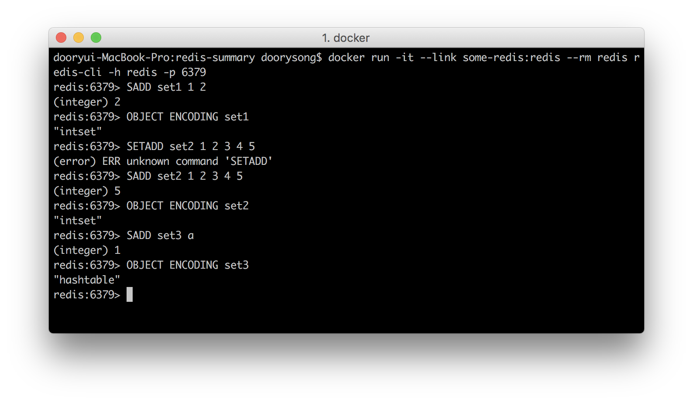 
        (set 데이터 타입)
    

     

- 해시
    - 해시에서는 ziplist, hashtable 인코딩을 사용한다.
        - ziplist : 해시의 필드 개수가 hash-max-ziplist-entries 설정보다 작고 해시의 필드 이름과 값이 hash-max-ziplist-value 설정보다 작으면 집 리스트가 사용된다.
        - hashtable : 해시의 필드 개수가 hash-max-ziplist-entries 설정보다 크거나 해시의 필드 값 중 하나라도 hash-max-ziplist-value(바이트) 설정보다 크면 해시테이블이 사용된다.

    

        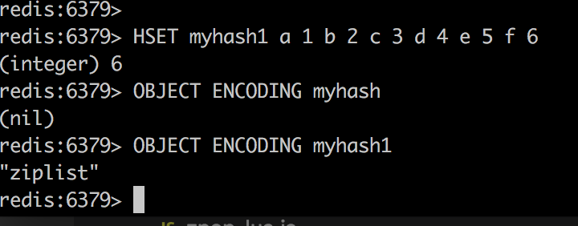 
        (hash 데이터 타입)
    

     

- 정렬된 셋
    - sorted set에서 사용 가능한 인코딩은 ziplist, skiplist + hashtable 이다.
        - ziplist : 정렬된 셋의 개수가 set-max-ziplist-entries 설정보다 작고, 정렬된 셋의 엘리먼트 값이 모두 zset-max-ziplist-value(바이트)설정보다 작으면 집리스트가 사용된다.
        - skiplist + hashtable : 정렬된 셋의 개수가 set-max-ziplist-entries 설정보다 크거나 sorted set의 엘리먼트 값 중 하나라도 zset-max-ziplist-value(바이트) 설정보다 크면 skiplist + hashtable이 사용된다.

    

        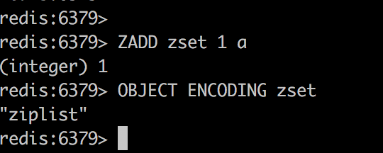 
        (sorted set 데이터 타입)
    

     

- 강제로 인코딩을 ziplist로 전환시킬수는 있으나, 성능과 메모리 사용량에 대한 트레이드 오프이기 때문에 잘 생각해봐야 한다.
- 테스트 이후 "INFO MEMORY" command를 통해 실제 메모리 사용량을 측정해 볼 수 있다.

## 일반적인 실수
- bitmap은 set, list와 다르게 들어간 키의 사이즈 중 가잔 큰 사이즈를 기반으로 사이즈가 픽스되기 때문에 저장 공간 효율이 더 안좋을 수 있다.
- 레디스에는 다중 레디스 데이터베이스가 존재하긴 하지만 이미 레디스에서 다중 데이터베이스가 사라질 것이라고 공식 바료된 상태이기 때문에 사용하지 않아야 한다.
    - 레디스는 단일 스레드 기반이므로, 하나의 레디스 서버의 다중 데이터베이스는 하나의 cpu 코어만 사용한다.
    - 다중 데이터베이스는 레디스 관리를 ㅓ렵게 하고 성능과 자원에 대한 사용 진단을 복잡하게 한다.
- 네임스페이스를 사용해야한다.
    - 키 이름을 정의할때 충돌을 피하기 위해 애플리케이션의 정보를 기반으로 키를 구성하기 위해 네임스페이스를 작성해라.
    - 레디스는 네임스페이스 기능을 지원하지 않는다. 그래서 prefix를 직접 작명해 붙여라.
- 스왑공간 설정을 확실히 해라
    - 램에만 레디스가 존재하게 하려면 swappiness 설정을 0으로 줘야 한다. 
    - 설정법 : https://zetawiki.com/wiki/%EB%A6%AC%EB%88%85%EC%8A%A4_swappiness
- 메모리를 적절하게 설정해야한다.
    - 레디스는 백업 프로세스에서 메모리가 최대 2배로 늘어날 수 있다.
    - RDB snapshot을 생성하고 AOF rewrite이 진행되는 동안 redis-server는 레디스를 복제해야한다. 즉 2배의 메모리가 들 수 있다는 것.
    - 따라서 레디스는 메모리의 50퍼센트 이상을 사용하지 못하도록 해야하며, 레디스 메모리 사용량에 대한 경고 알림을 반드시 설정해야한다.
- 부적절한 저장 전략
    - 8장 공부 이후 돌아옴

## 보안 기술
- 레디스는 신뢰할 만한 내부 네트워크에서 사용할 수 있도록 설계됐다.
- 레디스는 평문 패스워드를 사용해 클라이언트와 서버 간의 연결을 보호하는 기본적인 보안 시스템을 가지고 있다.
- 기본적인 보안
    - 레디스를 설계했을 때, 레디스의 주요 목표는 최고의 보안수준보다는 최고의 성능과 단순성이었다.
    - 레디스가 평문 패스워드를 기반으로 하는 기본 보안 매커니즘을 구현했지만, 레디스는 ACL을 구현하지 않았다. 따라서 퍼미션 레벨 단위로 사용자를 구분할 수 없다.
    - 인증 기능은 requirepass 설정으로 활성화할 수 있다.
    - 하지만 레디스는 빠르기 때문에, 악성 유저가 초당 수천 개의 패스워드를 요청해 잠재적으로 알아맞힐 수 있어서 requirepass 설정이 위험할 수도 있다.
    - 따라서 최소 64자의 복잡한 패스워드를 명세해 패스워드를 알아맞히지 못하게 해야한다.
    - requirepass를 활성화하면, 레디스는 인증 없는 클라이언트의 모든 커맨드 요청을 거부한다.
    - FLUSHDB, FLUSHALL, CONFIG, KEYS, DEBUG, SAVE 와 같은 명령어들을 알기 어렵게 하거나 사용을 금지하는 방법도 있다.
        - redis.conf에서 rename-command 설정을 통해 가능.
    - 이 이외에 네트워크 적으로 추가 보안을 적용하는 방법 등을 선택한다.
    - 한마디로 보안이 좀 약하다.

## 레디스 확장하기
- 저장
    - 레디스는 데이터를 메모리에 저장한다.
    - 메모리는 잠시 동안만 저장되는 임시 저장소라서 레디스 인스턴스가 종료, 크래시, 재시작되면 저장된 모든 데이터를 잃게 된다.
    - 따라서 데이터 손실 문제를 해결하기 위해 레디스는 저장 가능한 두 가지 방법, 레디스 데이터베이스(RDB)와 Append-only File(AOF)을 제공한다.
    - 동일한 레디스 인스턴스에서 두 방법을 개별적으로, 또는 동시에 사용할 수 있다.
    - 레디스 데이터베이스 (RDB)
        - rdb 파일은 특정 시점의 데이터 바이너리로, 레디스 인스턴스에 저장된 데이터를 표현한다.
        - rdb 파일 형태는 빠른 일기와 쓰기에 최적화돼 있다.
        - 성능을 높이기 위해 디시크의 rdb 파일의 내부 구조는 레디스 인메모리 구조와 매우 비슷하게 돼있다.
        - rdb파일 압축 시에 lzf압죽을 활용한다.
            - lzf 압축은 압축을 진행할 때 아주 작은 메모리를 사용하느 빠른 압축 알고리즘이다.
            - lzf 압축 알고리즘이 다른 알고리즘보다 최고의 압축률을 가지고 있지는 않다.
        - 레디스 인스턴스를 완전하게 복구 하는데 하나의 RDB 파일만 있으면 된다.
        - 필요할 때마다 매시간, 매일, 매주, 매달 RDB 파일을 저장할 수 있도록 할 수 있다.
        - SAVE 커맨드를 통해 RDB 파일을 즉시 생성할 수도 있다. 하지만 이 과정에서 레디스 서버를 블록하기 때문에 SAVE 커맨드를 사용하지 않도록 한다.
        - BGSAVE커맨드는 백그라운드에서 저장하기 때문에 레디스를 블록하지 않는다. (자식 프로세스로 실행)
        - 백그라운드로 RDB 파일을 저장할 때 성능 저하가 발생하지 않도록 reids-server는 모든 저장 작업을 수행해서 자식 프로세스를 생성한다. 따라서 redis-server 프로세스는 어떠한 디스크 I/O작업도 수행하지 않는다.
        - redis-server가 쓰기 작업을 받고 있는 상태면, 자식 프로세스는 변경된 메모리를 복사해야 한다. 이로 인해 전체 사용 메모리가 현격하기 증가할 수 있다.
            - 레디스는 copy-on-write를 사용한다.
        - 실제 redis.conf를 열어보면 이러한 설정이 있음 (save 900 1, save 300 10, save 60 10000)
            - save 지시자 문법은 save number_of_seconds number_of_changes 이다.
            - 즉 하나 이상의 쓰기 작업이 실행되면 900초마다 디스크에 rdb 파일 저장
            - 10개 이상의 쓰기 작업이 실행되면 300초마다 디스크에 rdb 파일 저장
            - 10,000개 이상의 쓰기 작업이 실행되면 60초마다 디스크에 rdb 파일을 저장
        - 단점
            - 즉 rdb는 해당 설정 이내의 100% 복구를 장담하지 못하기 때문에 이에 대한 대비가 필요하다.
            - 그리고 snapshot의 단점은 생성 시마다 레디스는 디스크에 데이터를 저장하기 위해 자식 프로세스를 생성한다는 점이다.
                - 자식 프로세스를 생성하는 동안 서비스중인 클라이언트를 멈추게 할 수 있다. 이 부분은 레디스에서 가지고 있는 데이터 집합의 크기에 영향을 받는다. 때로는 몇 ms에서 몇 s까지 걸릴 수 있다.
        - 레디스 설정에서 사용할 수 있는 RDB 관련 지시자는 다음과 같다
            - stop-writes-on-bgsabve-error : (yes or no) 마지막으로 실행한 백그라운드 저장이 실패한다면, 레디스가 쓰기 작업을 받는 것을 멈추도록 결정. 백그라운드 저장이 성공하면 쓰기 작업을 다시 받기 시작.
            - rdbcompression : (yes or no) rdb파일에 대해 lzf 압축을 사용할 지에 대한 옵션
            - rdbchecksum : rdb 파일의 마지막에 체크섬(checksum)을 저장하고, rdb 파일을 로딩하기 전에 체크섬을 수행할지에 대한 옵션, 체크섬이 옳지 않으면 레디스가 시작되지 않는다.
            - dbfilename : rdb파일의 이름을 결정한다.
            - save 초와 변경 수를 기반으로 스넵샷 주기를 설정
            - dir: AOF와 RDB파일의 디렉토리 위치를 명세한다.
        - Append-only File (AOF)
            - 레디스는 데이터 집합을 변경하는 커맨드를 받을 때마다, AOF 파일에 해당 커맨드를 추가한다.
            - 이를 바탕으류ㅗ 레디스에 AOF 설정을 적용한 후 레디스를 재시작하면, 레디스는 AOF의 나열된 모든 커맨드를 순서대로 실행해 데이터를 복구할 수 있으며 데이터의 상태를 재구축한다.
            - AOF는 RDB 스냅샷의 대안이다.
            - AOF 파일은 '사람이 읽을 수 있는' 로그를 추가만 할 수 있는 로그 파일이다.
            - 즉 검색이나 손상 문제를 쉽게 식별할 수 없음을 의미한다.
            - 텍스트 에디트에서 열어볼 수도 잇고 내부 구조도 이해할 수 있다.
            - AOF가 불완전하거나 손상되는 경우 AOF 파일을 쉽게 확인하고 고칠 수 있는 redis-check-aof 툴이 존재한다.
            - 여러 옵션을 사용해 AOF을 자동으로 작은 버전으로 최적화하거나, BGREWRITEAOF 커맨드를 통해 수동으로 작으 버전으로 최적화할 수 있다.
            - AOF파일을 저장하는 동안 크래시가 발생한다면 원본 AOF파일은 변경되지 않는다.
            - AOF 관련 설정에서 사용할 수 있는 지시자는 다음과 같다.
                - appendonly : (yes or no)AOF의 사용 여부를 설정한다.
                - appendfilename : AOF 파일 이름을 명세한다. 파일 경로를 쓸 수 없다.
                - appendfsync : 주요 프로세스에서 fsync(운영체제가 데이터를 디스크에 Flush할 때 쓰이는 시스템 호출 - https://www.joinc.co.kr/w/man/2/fsync)를 수행하기 위해 백그라운드 스레드를 사용한다.
                    - no : fsync를 실행하지 않는다.
                    - always : 모든 쓰기 작업마다 fsync를 실행한다.
                    - everysec : 매초 실행한다. (appendfsync 옵션의 기본값)
                - no-appendfsync-on-rewirte : (yes or no) 대량의 쓰기 발생하여 지연이 발생할 시 레디스 서버에서 fsync를 실행하지 않는다.
                - auto-aof-rewrite-percentage : (0~100) AOF 파일 크기가 해당 옵션에서 명세한 퍼센트까지 도달하면 암북적으로 BGREWRITEAOF 커맨드를 수행, 기본 값은 100
                - auto-aof-rewirte-min-size : 해당 옵션은 AOF 파일의 최소 크기다. 명세한 auto-aof-rewrite-percentage 값을 초과하면, 명세한 최소 크기에 도달할 때까지 AOF저장이 안되도록 한다. 기본값은 67,108,864 바이트이다.
                - aof-load-turncated : (yes or no) 레디스에 크래시가 발생할 경우 레디스 시작시 AOF 파일을 로드할지 여부를 명세. 만약 no면 로드하지 않고 에러를 출력하고 종료할 것이다.
                - dir : AOF와 RDB 파일의 디렉토리 위치를 명세한다.
        - RDB대 AOF
            - 큰 데이터 집합을 복구할 때, 복구 속도는 RDB가 AOF보다 빠르다. RDB는 전체 데이터베이스에서 발생하는 모든 변경을 재실행할 필요가 없기 때문이다.
            - 레디스는 시작 시 RDB와 AOF파일 중 하나라도 존재하면 그 파일을 로드한다. 두 파일 모두 존재하면 AOF가 내구성이 보장돼 있기 때문에 AOF가 우선권을 가진다.
            - 주의사항
                - 애플리케이션에서 저장이 필요하지 않다면 RDB와 AOF를 비활성한다.
                - 애플리케이션에서 약간의 데이터 손실이 허용된다면 RDB를 사용한다.
                - 애플리케이션에서 완전히 내구성 있는 저장이 필요하다면, RDB와 AOF를 둘 다 사용한다.

